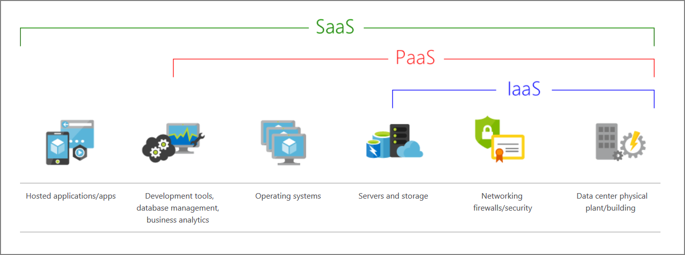

# Advantages and Cloud Models

## Cloud Advantages
- **High availability**
    - Depending on the SLA chosen applications can provide continuos user experience with no apparent downtime
- **Elasticity**
    - Ability to auto increase/decrease resources as needed 
- **Scalability**
    - Vertical: increase of computing capacity by adding RAM or CPUs
    - Horizontally: increase of computing capacity by adding istances of a resource  
- **Agility**
    - Resources can be deployed quickly as application requirements change
- **Geo-distribution**
    - Application and data can be deployed around the world to obtain best client latency
- **Disaster recovery**
    - Based on geo-distribution, data replication and backup services

## Cloud Service Models
- IaaS
    - No CapEx
    - Agility
    - Management by shared responsibility model
    - Consumption-based model
    - No deep technical skills are required to deploy, use, and gain the benefits of a public cloud
    - Cloud benefits
    - Most flexibility 
- PaaS
    - No CapEx
    - Agility: PaaS is more agile than IaaS
    - Consumption-based model
    - No deep technical skills are required to deploy, use, and gain the benefits of PaaS
    - Cloud benefits
    - Productivity
    - **CONS** Platform limitations: There can be some limitations to a cloud platform that might affect how an application runs
- SaaS
    - No CapEx
    - Agility
    - Pay-as-you-go pricing model
    - No deep technical skills are required to deploy, use, and gain the benefits of SaaS
    - Flexibility
    - **CONS** Software limitations. There can be some limitations to a software application that might affect how users work

- Serveless: concept overlapping with PaaS: servers are still running the code but the tasks associated with infrastructure provisioning and management are invisible to the developer.

## Cloud Deployment Models
- Private
    - Computing resources are used exclusively by users from one business or organization. Can be hosted by third-party service provider. 
- Public
    - Cloud resources like servers and storage are owned and operated by a third-party cloud service provider and delivered over the internet
- Hybrid
    - Combination of public and private by allowing data and applications to be shared between them