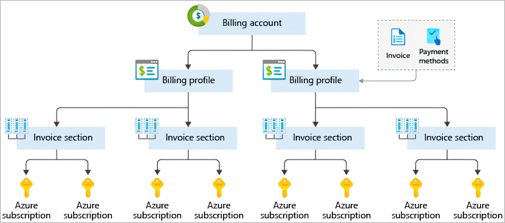

# Cloud Basic Concepts

## Capital expenses vs. operating expenses
- **Capital Expenditure (CapEx)**
    - is the up-front spending of money on physical infrastructure, and then deducting that up-front expense over time. The up-front cost from CapEx has a value that reduces over time.
    - requires significant up-front financial costs
    - ongoing maintenance and support expenditures
- **Operational Expenditure (OpEx)**
    - is spending money on services or products now, and being billed for them now. You can deduct this expense in the same year you spend it. There is no up-front cost, as you pay for a service or product as you use it.
    - consumption-based model like Cloud Services
    - has a direct impact on net profit, taxable income, and the associated expenses on the balance sheet

## Subscriptions, management groups, and resources
- **Subscriptions**
    - Logical unit of Azure services that links to an Azure account, which is an identity in Azure Active Directory (Azure AD) or in a directory that Azure AD trusts.
    - Can be used to define boundaries around Azure products, services, and resources:
        - Billing boundary: separate billing reports and invoices for each subscription
        - Access control boundary: access-management policies applied at the subscription level so that separate subscriptions can be createde to reflect different organizational structures
    - Maximum number of Azure ExpressRoute circuits per subscription is 10

- **Management groups**
    - Level of scope above subscriptions
    - These groups help you manage access, policy, and compliance for multiple subscriptions. All subscriptions in a management group automatically inherit the conditions applied to the management group.
    - 10000 management groups can be supported in a single directory.
    - A management group tree can support up to six levels of depth. This limit doesn't include the root level or the subscription level.
    - Each management group and subscription can support only one parent.
    - Each management group can have many children.
    - All subscriptions and management groups are within a single hierarchy in each directory.

- **Resources**
    - A manageable item that's available through Azure
    - All resources must be in a resource group
    - A resource can only be a member of a single resource group
    - Resources are instances of services that you create, like virtual machines, storage, or SQL databases.

- **Resource groups**
    - A logical container that holds related resources for an Azure solution
    - Resources are combined into resource groups, which act as a logical container into which Azure resources like web apps, databases, and storage accounts are deployed and managed.
    - **Can't be nested**

## Azure Resource Manager (ARM)
- Deployment and management service for Azure
- Management layer that enables you to create, update, and delete resources in your Azure account
- Benefits:
    - Manage your infrastructure through declarative templates rather than scripts. A Resource Manager template is a JSON file that defines what you want to deploy to Azure.
    - Deploy, manage, and monitor all the resources for your solution as a group, rather than handling these resources individually.
    - Redeploy your solution throughout the development life cycle and have confidence your resources are deployed in a consistent state.
    - Define the dependencies between resources so they're deployed in the correct order.
    - Apply access control to all services because RBAC is natively integrated into the management platform.
    - Apply tags to resources to logically organize all the resources in your subscription.
    - Clarify your organization's billing by viewing costs for a group of resources that share the same tag.
