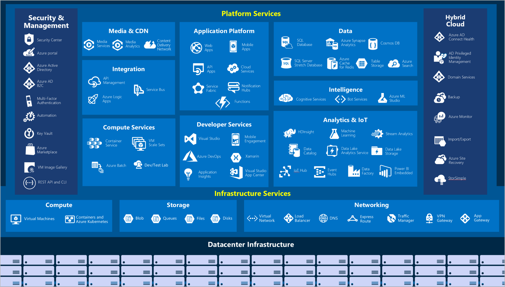

# Cloud Computing Advantages

- **High availability**
    - Depending on the SLA chosen applications can provide continuos user experience with no apparent downtime
- **Elasticity**
    - Ability to auto increase/decrease resources as needed 
- **Scalability**
    - Vertical: increase of computing capacity by adding RAM or CPUs
    - Horizontally: increase of computing capacity by adding istances of a resource  
- **Agility**
    - Resources can be deployed quickly as application requirements change
- **Geo-distribution**
    - Application and data can be deployed around the world to obtain best client latency
- **Disaster recovery**
    - Based on geo-distribution, data replication and backup services

# Cloud Service Models
- IaaS
    - No CapEx
    - Agility
    - Management by shared responsibility model
    - Consumption-based model
    - No deep technical skills are required to deploy, use, and gain the benefits of a public cloud
    - Cloud benefits
    - Most flexibility 
- PaaS
    - No CapEx
    - Agility: PaaS is more agile than IaaS
    - Consumption-based model
    - No deep technical skills are required to deploy, use, and gain the benefits of PaaS
    - Cloud benefits
    - Productivity
    - **CONS** Platform limitations: There can be some limitations to a cloud platform that might affect how an application runs
- SaaS
    - No CapEx
    - Agility
    - Pay-as-you-go pricing model
    - No deep technical skills are required to deploy, use, and gain the benefits of SaaS
    - Flexibility
    - **CONS** Software limitations. There can be some limitations to a software application that might affect how users work

- Serveless: concept overlapping with PaaS: servers are still running the code but the tasks associated with infrastructure provisioning and management are invisible to the developer.

# Cloud Deployment Models
- Private
    - Computing resources are used exclusively by users from one business or organization. Can be hosted by third-party service provider. 
- Public
    - Cloud resources like servers and storage are owned and operated by a third-party cloud service provider and delivered over the internet
- Hybrid
    - Combination of public and private by allowing data and applications to be shared between them

# Azure Portal
- Web-based unified console alternative to command-line tools.
- Build, manage, and monitor everything from simple web apps to complex cloud deployments.
- Create custom dashboards for an organized view of resources.
- Configure accessibility options for an optimal experience.
- Maintains a presence in every Azure datacenter 

# Azure Marketplace
- Solution catalog
- All solutions and services are certified to run on Azure

# Azure services

## Commonly used categories
- Compute
    - **Azure Virtual Machines**: Windows or Linux virtual machines (VMs) hosted in Azure.
    - **Azure Virtual Machine Scale Sets**: Scaling for Windows or Linux VMs hosted in Azure.
    - **Azure Kubernetes Service**: Cluster management for VMs that run containerized services.
    - **Azure Service Fabric**:	Distributed systems platform that runs in Azure or on-premises.
    - **Azure Batch**: Managed service for parallel and high-performance computing applications.
    - **Azure Container Instances**: Containerized apps run on Azure without provisioning servers or VMs.
    - **Azure Functions**: An event-driven, serverless compute service.
- Networking
    - **Azure Virtual Network**: Connects VMs to incoming virtual private network (VPN) connections.
    - **Azure Load Balancer**: Balances inbound and outbound connections to applications or service endpoints.
    - **Azure Application Gateway**: Optimizes app server farm delivery while increasing application security.
    - **Azure VPN Gateway**: Accesses Azure Virtual Networks through high-performance VPN gateways.
    - **Azure DNS**: Provides ultra-fast DNS responses and ultra-high domain availability.
    - **Azure Content Delivery Network**: Delivers high-bandwidth content to customers globally.
    - **Azure DDoS Protection**: Protects Azure-hosted applications from distributed denial of service (DDOS) attacks.
    - **Azure Traffic Manager**: Distributes network traffic across Azure regions worldwide.
    - **Azure ExpressRoute**: Connects to Azure over high-bandwidth dedicated secure connections.
    - **Azure Network Watcher**: Monitors and diagnoses network issues by using scenario-based analysis.
    - **Azure Firewall**: Implements high-security, high-availability firewall with unlimited scalability.
    - **Azure Virtual WAN**: Creates a unified wide area network (WAN) that connects local and remote sites.
- Storage
    - **Azure Blob storage**: Storage service for very large objects, such as video files or bitmaps.
    - **Azure File storage**: File shares that can be accessed and managed like a file server.
    - **Azure Queue storage**: A data store for queuing and reliably delivering messages between applications.
    - **Azure Table storage**: Table storage is a service that stores non-relational structured data (also known as structured NoSQL data) in the cloud, providing a key/attribute store with a schemaless design..
- Databases
    - **Azure Cosmos DB**: Globally distributed database that supports NoSQL options.
    - **Azure SQL Database**: Fully managed relational database with auto-scale, integral intelligence, and robust security.
    - **Azure Database for MySQL**: Fully managed and scalable MySQL relational database with high availability and security.
    - **Azure Database for PostgreSQL**: Fully managed and scalable PostgreSQL relational database with high availability and security.
    - SQL Server on Azure Virtual Machines: Service that hosts enterprise SQL Server apps in the cloud.
    - Azure Synapse Analytics: Fully managed data warehouse with integral security at every level of scale at no extra cost.
    - Azure Database Migration Service:	Service that migrates databases to the cloud with no application code changes.
    - **Azure Cache for Redis**: Fully managed service caches frequently used and static data to reduce data and application latency.
    - **Azure Database for MariaDB**: Fully managed and scalable MariaDB relational database with high availability and security.
- Web hosting
    - **Azure App Service**: Quickly create powerful cloud web-based apps.
    - **Azure Notification**: Hubs	Send push notifications to any platform from any back end.
    - **Azure API Management**: Publish APIs to developers, partners, and employees securely and at scale.
    - **Azure Cognitive Search**: Deploy this fully managed search as a service.
    - **Web Apps feature of Azure App Service**: Create and deploy mission-critical web apps at scale.
    - **Azure SignalR Service**: Add real-time web functionalities easily.
- IoT
    - **IoT Central**: Fully managed global IoT software as a service (SaaS) solution that makes it easy to connect, monitor, and manage IoT assets at scale.
    - **Azure IoT Hub**: Messaging hub that provides secure communications between and monitoring of millions of IoT devices.
    - **IoT Edge**: Fully managed service that allows data analysis models to be pushed directly onto IoT devices, which allows them to react quickly to state changes without needing to consult cloud-based AI models.
- Big Data
    - **Azure Synapse Analytics**: Run analytics at a massive scale by using a cloud-based enterprise data warehouse that takes advantage of massively parallel processing to run complex queries quickly across petabytes of data.
    - **Azure HDInsight**: Process massive amounts of data with managed clusters of Hadoop clusters in the cloud.
    - **Azure Databricks**:	Integrate this collaborative Apache Spark-based analytics service with other big data services in Azure.
- AI
    - **Azure Machine Learning Service**: Cloud-based environment you can use to develop, train, test, deploy, manage, and track machine learning models. It can auto-generate a model and auto-tune it for you. It will let you start training on your local machine, and then scale out to the cloud.
    - **Azure ML Studio**: Collaborative visual workspace where you can build, test, and deploy machine learning solutions by using prebuilt machine learning algorithms and data-handling modules.
    - **Azure BOT Services**
- DevOps
    - **Azure DevOps**: Use development collaboration tools such as high-performance pipelines, free private Git repositories, configurable Kanban boards, and extensive automated and cloud-based load testing. Formerly known as Visual Studio Team Services.
    - **Azure DevTest Labs**: Quickly create on-demand Windows and Linux environments to test or demo applications directly from deployment pipelines.
    - **Github**
    - **Github Actions for Azure**
