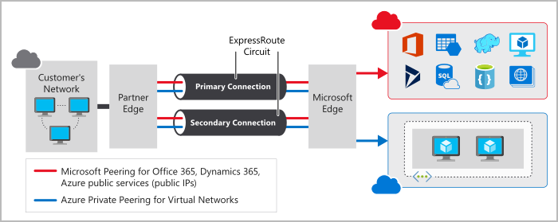

# Networking Services

## Azure Virtual Network
- Provides network capabilities
  - isolation & segmentation (public/private IP, adress spaces, subnets, name resolution)
  - communication with internet (public IP)
  - communication between resources (via Virtual networks or via service endpoints)
  - communication with on-prem resources (via point2point VPN, via site2site VPN, via Azure ExpressRoute)

### VNet settings
- network name
  - unique per subscription
- adress space
  - unique per subscription and per networks you connect to
  - format CIDR
  - examples:
    - 10.0.0.0/24 = from 10.0.0.1 to 10.0.0.254 overlaps 10.0.0.0/8 = from 10.0.0.1 to 10.255.255.254
    - 10.0.0.0/16 = from 10.0.0.1 to 10.0.255.254 DOES NOT overlap 10.1.0.0/16 = from 10.1.0.1 to 10.1.255.254
- subscription
- resource group
- location
- subnet
- DDoS protection (Basic or Standard, last one is a premium service)
- Service endpoints

## Azure VPN Gateway
- deployed in Azure Virtual Networks instances
- enables
  - connection on prem with cloud vnet via site2site
  - connection of individual devices to vnet via point2site
  - connection of vnet to other vnet via network2network
- data encrypted in a private tunnel across the internet
- only 1 per vnet
- uses pre shared key based on Internet Key Exchange (IKE) then IPSec
- can work policy based or route based
  - policy: static routing made by explicit mapping of IP to encrypt (compatibility with legacy scenarios)
  - route: tunnels modeled as interfaces ignoring IP adresses behind (more resilient to topology changes) in scenarios like connections between vnets, point2site connections, multisite connections, coexistence with an Azure ExpressRoute gateway
  - sizes are detemined by SKU (from basic to VpnGw1, 2, 3, 10 to 30 tunnels)

## Azure ExpressRoute
- extends on prem networks into MS Cloud
- data doesn't travel over the internet but on a private connection
- has 3 models
  - Cloud Exchange colocation
  - point2point ethernet connection
  - any2any connection (WAN scenario with connection to all on prem offices and datacenter)

