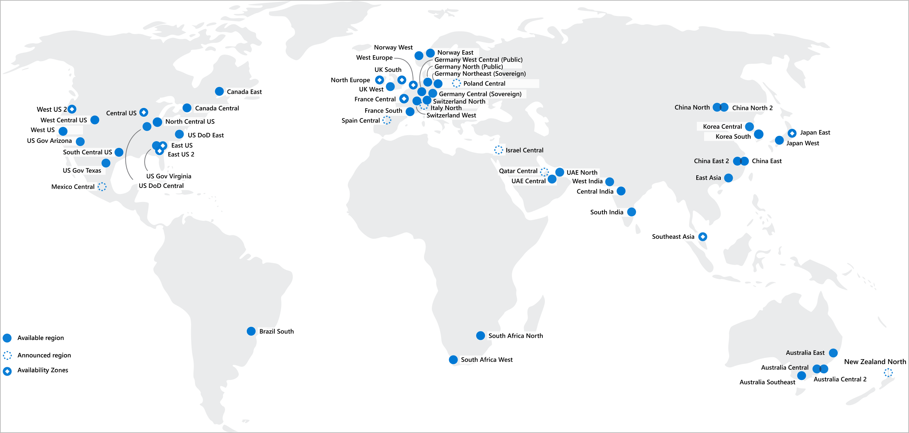

# Regions
- Geographical area on the planet that contains at least one but potentially multiple datacenters that are nearby and networked together with a low-latency network
- Special Regions for compliance or legal purposes 
    - US DoD Central, US Gov Virginia, US Gov Iowa and more: These regions are physical and logical network-isolated instances of Azure for U.S. government agencies and partners. These datacenters are operated by screened U.S. personnel and include additional compliance certifications.
    - China East, China North, and more: These regions are available through a unique partnership between Microsoft and 21Vianet, whereby Microsoft doesn't directly maintain the datacenters.

# Availability Zones
- Physically separate datacenters within an Azure region
- Each availability zone is made up of one or more datacenters equipped with independent power, cooling, and networking
- Not every region has support for availability zones
- Primarily for VMs, managed disks, load balancers, and SQL databases

# Azure region pairs
- Each Azure region is always paired with another region within the same geography (such as US, Europe, or Asia) at least 300 miles away
- Reduce the likelihood of interruptions because of events such as natural disasters, civil unrest, power outages, or physical network outages that affect both regions at once
- Planned Azure updates are rolled out to paired regions one region at a time to minimize downtime and risk of application outage
- If an extensive Azure outage occurs, one region out of every pair is prioritized to make sure at least one is restored as quickly as possible for applications hosted in that region pair
