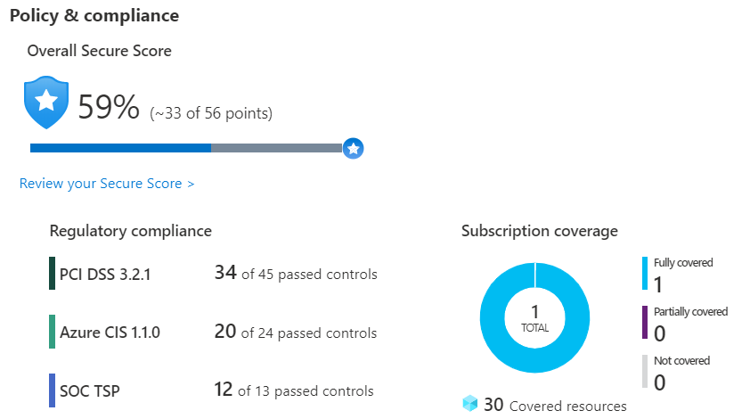

# Azure Security Concepts and Tools

## Azure Security Center
- monitoring service for cloud and on premises workloads
- covers cybersecurity policies, controls, prediction, prevention and response to threats
- checks against any governance policy assigned

## Azure Sentinel
- Security Information and Event Management (SIEM)
- collect cloud data at scale
- detect previously undetected threats using built-in and custom analytics
- investigate threats with AI
- respond to incidents rapidly using automated responses via Azure Monitor Workbooks
- build-in connectors (MS Solutions, Azure AD, AWS, Citrix and other non MS solutions, Syslog, REST and others)

## Azure Key Vault
- manages secrets
- manage encryption keys
- manage SSL/TLS certificates
- store secrets backed by hardware security modules
- benefits:
  - integrated with Azure
  - centralized and monitored and simplified management

## Azure Dedicated Host
- dedicated hardware may be needed for compliance
- charged per dedicated host not for the number of VMs deployed (host price based on VM type)

## Azure Firewall
- managed service for network security
- stateful, i.e. analyzing the complete context not only the packet
- included with Azure Monitor
- features included like scalability, filtering rules, HA, logging
- NAT rules to translate inbound requests

## DDoS protection
- Basic
  - free
  - common monitor and mitigation
- Standard
  - additional capabilities
  - prevent volumetric, protocol and resource-layer attacks

## Network security group
- filter traffic to and from resources by rules specified by properties like
  - name, priority, source/destination IP, protocol, direction, port range, action

## Concepts
- layered defense

- security posture
  - organization's ability to protect from and respond to security threats
    - confidentiality
    - integrity
    - availability

## Azure network services combination
- Perimeter layer (firewall and DDoS protections)
- Network layer (limit network connectivity across resouruces)
- Using
  - Azure Firewall is a managed, cloud-based network security service that helps protect resources in Azure virtual networks
  - An Azure virtual network is similar to a traditional network that you'd operate in your own datacenter. It enables virtual machines and other compute resources to securely communicate with each other, the internet, and on-premises networks
  - A network security group (NSG) enables you to filter network traffic to and from Azure resources within a virtual network
  - Azure DDoS Protection helps protect Azure resources from DDoS attacks